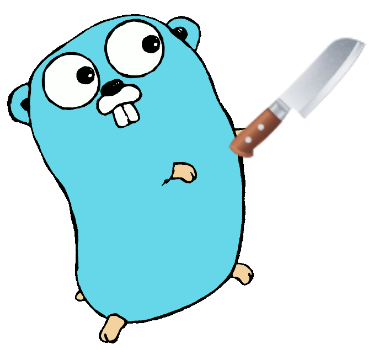

# <p align="center">CoverCut<p>

<p align="center">

</p>

<!-- markdownlint-disable MD013 -->
<!-- it's unable to past links as references, when you trying to center links-->
<p align="center">
<a href="https://pkg.go.dev/github.com/xelaj/tl">

</a>
<a href="https://goreportcard.com/report/github.com/xelaj/tl">

</a>
<a href="https://codecov.io/gh/xelaj/tl">

</a>
<a href="https://bit.ly/2xlsVsQ">

</a>
<br/>
<a href="https://github.com/xelaj/tl/releases">

</a>

<a href="https://github.com/xelaj/tl/blob/main/LICENSE.md">

</a>

<!--
code quality
golangci
contributors
go version
gitlab pipelines
-->
</p>
<!-- markdownlint-enable MD013 -->


### <p align="center">Just cut it! 🔪</p>

**english** [русский][index_ru]

## 🤔 What is it?

Coverage reports can return a lot of false positives, e.g. in most cases you don't need to cover `Error() string` implemenation, cause 99.9% it's just a `fmt.Sprintf` caller and that's it.

Covercut cuts your cover profiles, and adding ignoring feature, when you getting cover reports. Let's see it in action:

```go
package main

func DoSomething() error { // this part we strictly need to test! ⚠️
    if answer == 42 {
        return doX()
    }

    if err := doDangerous(); err == nil {
        return nil
    }

    // if go test won't catch this line, your Error() func won't be covered 😱
    return ErrWorldIsInFire{Wrapped: err}
}

type ErrWorldIsInFire struct {
    Wrapped error
}

func (e ErrWorldIsInFire) Error() string { // But this one? Who cares? 🔥
    return "Oh jeez! We will die! Here is the error: " + e.Wrapped.error()
}
```

This tool helps you filter coverage outputs, and ignore functions you don't need to test!

```go
type ErrWorldIsInFire struct {
    Wrapped error
}

//                                            ↓  this comment helps you to
//                                            ↓ filter coverage false positive!
func (e ErrWorldIsInFire) Error() string { //cover:ignore
    return "Oh jeez! We will die! Here is the error: " + e.Wrapped.error()
}

```


## ✨ Features

*

## ⌚️ Getting started

Here are some usage cases, how you can do some stuff:

### Add ignore comments

```go
type ErrCustom struct{}

func (e ErrCustom) Error() string { //cover:ignore
    return "Oops! Some error here!"
}

```

### Download and test

```sh
🔘 $ brew install covercut

     Processing... Done!

🟢 $ go test -coverprofile=cover.out

     # first argument is a path to your module,
     # so covercut will understand where to find comments
🟢 $ `covercut ./path/to/source/code ./cover.out > cover_filtered.out`

🟢 $ # Tadah! Now you can analyze your cover profile without false positives!

```

[![View demo][shield_view_demo]](https://go.dev/play/)

### Run in Github Action

## 🦊 Who use it

* [MTProto][mtproto]
* [TypeLang][tl]
* Mmmm...me?

## 💎 Contributing

Please read [contributing guide][gh_contributing] if you want to help. And the
help is very necessary!

**Don't want code?** Read [this page][gh_support]! We love nocoders!

## 🐛 Security bugs?

Please, **don't** create issue which describes security bug, this can be too
offensive! Instead, please read [this notification][gh_security] and follow that
steps to notify us about problem.

## 🏋️ TODO

* [ ] Publich to homebrew

## 📒 Running project scripts

This project uses [go-task][taskfile], it's not important to understand, what's
going on, (since you can just see into `Taskfile.yaml` and see all commands).
For better experience, you can download go-task and run tasks e.g. via
`$ task <taskname>`. All tasks can be shown via `$ task --list-all`

## 👨‍👩‍👧‍👦 Authors

* **Richard Cooper** <[rcooper.xelaj@protonmail.com](mailto:rcooper.xelaj@protonmail.com)>

## 📝 License

This project is licensed under the MIT License - see the [LICENSE][license_en]
file for details

Если вы находитесь в россии, или как-либо связаны с российским правительством,
(например, являетесь российским налогоплательщиком) на вас распостраняется
[отдельная лицензия][license_ru].

## One important thing

Even that maintainers of this project are generally from russia, we still stand
up with Ukraine, and from beginning of war, decided to stop paying any taxes, or
cooperate in any case with government, and companies, connected with government.
This is absolutely nothing compared to how much pain putin brought to the
fraternal country. And we are responsible for our inaction, and the only thing
we can do is to take at least any actions that harm putin’s regime, and help the
victims of regime using all resources available for us.


<!--
V2UndmUga25vd24gZWFjaCBvdGhlciBmb3Igc28gbG9uZwpZb3
VyIGhlYXJ0J3MgYmVlbiBhY2hpbmcgYnV0IHlvdSdyZSB0b28g
c2h5IHRvIHNheSBpdApJbnNpZGUgd2UgYm90aCBrbm93IHdoYX
QncyBiZWVuIGdvaW5nIG9uCldlIGtub3cgdGhlIGdhbWUgYW5k
IHdlJ3JlIGdvbm5hIHBsYXkgaXQKQW5kIGlmIHlvdSBhc2sgbW
UgaG93IEknbSBmZWVsaW5nCkRvbid0IHRlbGwgbWUgeW91J3Jl
IHRvbyBibGluZCB0byBzZWU=
-->

--------------------------------------------------------------------------------

<p align=center><sub><sub>
Created with love 💜 and magic 🦄 </br> Xelaj Software, 2022
</sub></sub></p>

[mtproto]:       https://github.com/xelaj/mtproto
[tl]:            https://github.com/xelaj/tl
[taskfile]:      https://taskfile.dev/
[ton_issue]:     https://github.com/ton-blockchain/ton/issues/31

<!-- images -->


<!-- localizations -->
[index_ru]: https://github.com/xelaj/tl/blob/-/docs/ru_RU/README.md

<!-- project links -->
[godoc]:              https://pkg.go.dev/github.com/xelaj/tl
[license_ru]:         https://github.com/xelaj/tl/blob/-/docs/ru_XZ/LICENSE.md
[license_en]:         https://github.com/xelaj/tl/blob/-/LICENSE.md
[gh_examples]:        https://github.com/xelaj/tl/blob/-/examples
[gh_security]:        https://github.com/xelaj/tl/blob/-/.github/SECURITY.md
[gh_support]:         https://github.com/xelaj/tl/blob/-/.github/SUPPORT.md
[gh_contributing]:    https://github.com/xelaj/tl/blob/-/.github/CONTRIBUTING.md

[shield_view_demo]:  https://gist.githubusercontent.com/quenbyako/9aae4a4ad4ff0f9bab9097f316ce475f/raw/view_demo.svg